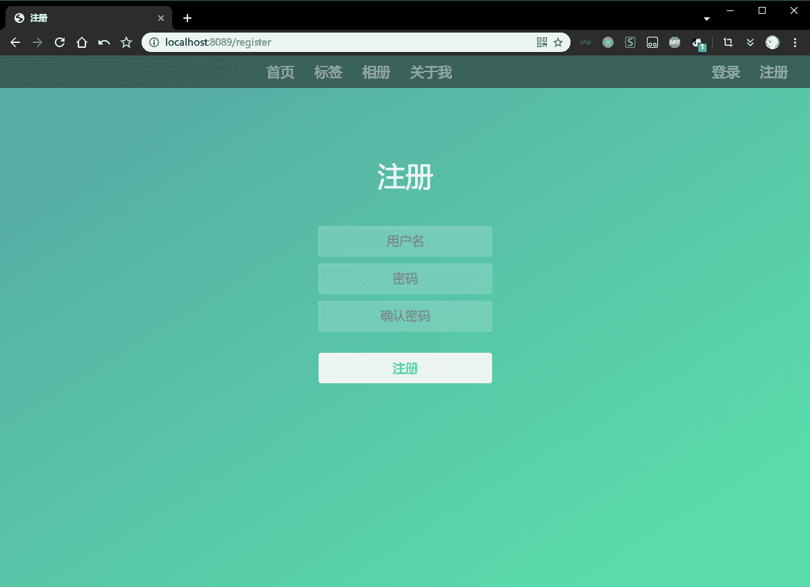
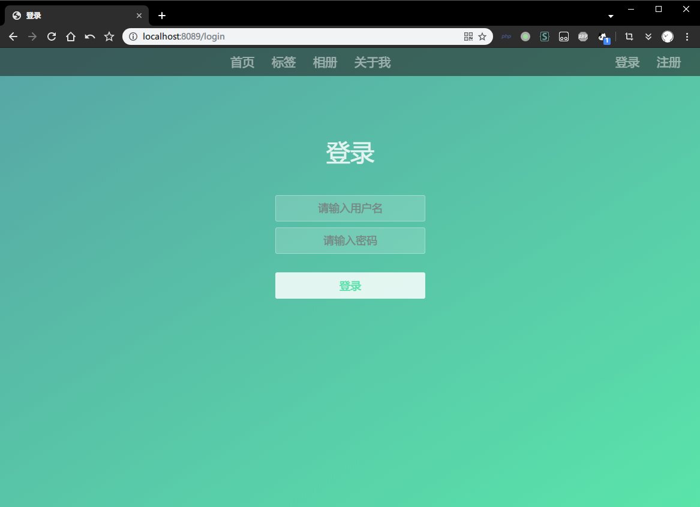
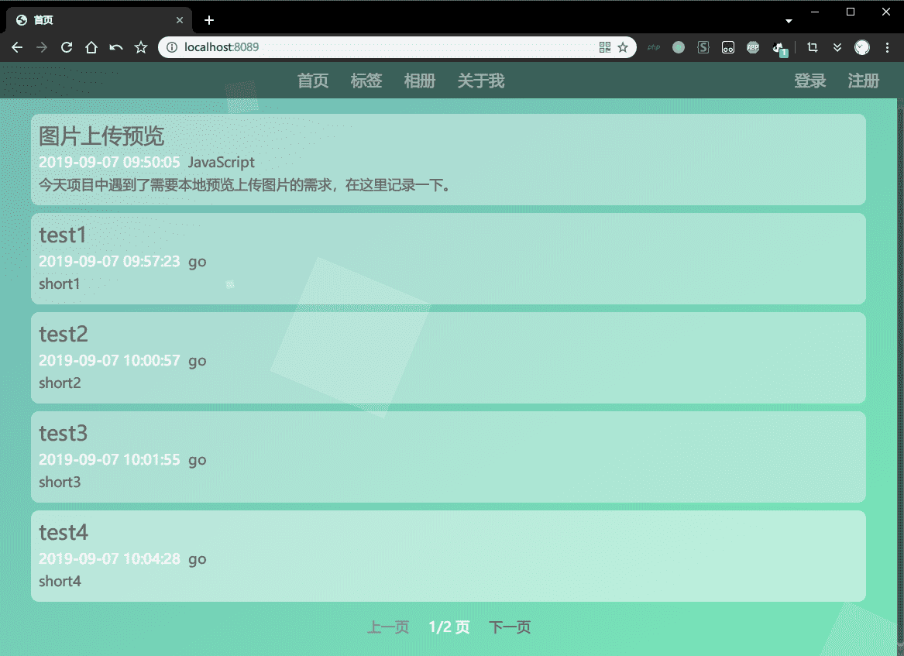
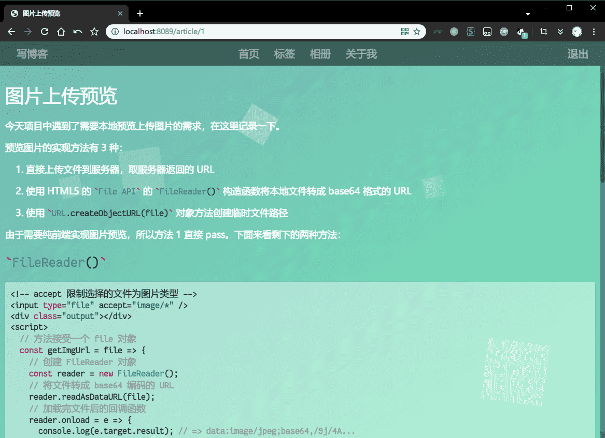

# go-web-blog

本项目是基于beego开发的一个博客系统，采用传统MVC架构开发。

数据库使用MySQL，由beego自带的orm驱动。

## 功能

- [x] 注册
- [x] 登录
- [x] 退出登录
- [x] 写文章
- [x] 显示文章内容
- [x] 更新文章内容
- [x] 删除文章
- [x] 标签页
- [x] 相册页
- [x] 关于我页面

## 文件结构

```text
go-web-blog
│  main.go // 项目入口
│          
├─conf // 项目配置文件
│      
├─controllers // 控制器
│      
├─models // 模型
│      
├─routers // 路由
│      
├─static // 静态资源
│      
├─utils // 工具方法
│      
└─views // 视图
```

## 效果预览

- 注册



- 登录



- 首页-未登录



- 首页-已登录


- 写文章


- 显示文章内容



- 更新文章内容


- 标签页


- 标签页详情


- 相册


- 关于我


